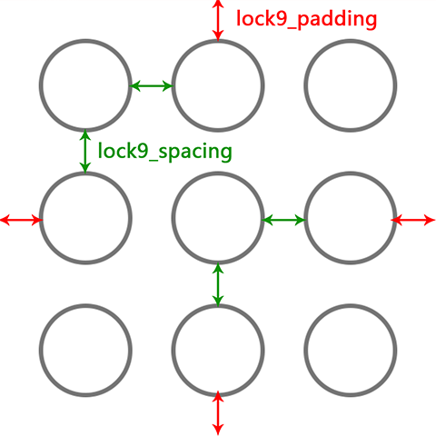
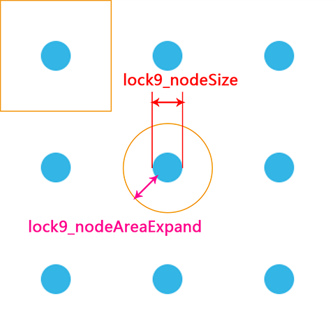

# Android - Lock9View

[](https://developer.android.com)
[](https://android-arsenal.com/api?level=21)
[](LICENSE)
[](https://jitpack.io/#TakWolf/Android-Lock9View)

A nine grid lock screen view for Android.

## Screenshot


## Usage

```kotlin
repositories {
    maven { setUrl("https://jitpack.io") }
}

dependencies {
    implementation("com.github.TakWolf:Android-Lock9View:0.0.0")
}
```

### Layout Example 1

``` xml
<com.takwolf.android.lock9view.Lock9View
    android:id="@+id/lock_9_view"
    android:layout_width="match_parent"
    android:layout_height="wrap_content"
    android:layout_gravity="center"
    app:lock9_nodeSrc="@drawable/node_normal"
    app:lock9_nodeOnSrc="@drawable/node_active"
    app:lock9_nodeOnAnim="@anim/node_on_1"
    app:lock9_padding="28dp"
    app:lock9_spacing="28dp"
    app:lock9_lineColor="@color/blue_light"
    app:lock9_lineWidth="8dp"
    app:lock9_autoLink="false"
    app:lock9_enableVibrate="true"
    app:lock9_vibrateTime="20" />
```



### Layout Example 2

``` xml
<com.takwolf.android.lock9view.Lock9View
    android:id="@+id/lock_9_view"
    android:layout_width="match_parent"
    android:layout_height="wrap_content"
    android:layout_margin="24dp"
    android:layout_gravity="center"
    app:lock9_nodeSrc="@drawable/node_small_normal"
    app:lock9_nodeOnSrc="@drawable/node_small_active"
    app:lock9_nodeOnAnim="@anim/node_on_2"
    app:lock9_nodeSize="16dp"
    app:lock9_nodeAreaExpand="24dp"
    app:lock9_lineColor="@color/blue_light"
    app:lock9_lineWidth="4dp"
    app:lock9_autoLink="true"
    app:lock9_enableVibrate="true"
    app:lock9_vibrateTime="20" />
```



**PS :**

**If use *"lock9_nodeSize"* , it will ignore *"lock9_padding"* and *"lock9_spacing"*.**

**The nodes will be layout on the center of 9 average areas.**

### Touch Area

If you want to draw a small node with a bigger touch area, please user :

```
app:lock9_nodeAreaExpand="24dp"  // default is 0
```

touchArea = lock9_nodeSize + lock9_nodeAreaExpand * 2

### Animation

```
app:lock9_nodeOnAnim="@anim/node_on_2"
```

### AutoLink


```
app:lock9_autoLink="true" // default is false
```

### Vibrate

```
app:lock9_enableVibrate="true"  // default is false
app:lock9_vibrateTime="20"      // default is 20 milliseconds
```

Also need :

``` xml
<uses-permission android:name="android.permission.VIBRATE" />
```

### Activity

``` java
Lock9View lock9View = (Lock9View) findViewById(R.id.lock_9_view);
lock9View.setGestureCallback(new Lock9View.GestureCallback() {

    @Override
    public void onNodeConnected(@NonNull int[] numbers) {
        // Do something
    }

    @Override
    public void onGestureFinished(@NonNull int[] numbers) {
        // Do something
    }

});
```

## License

[Apache License 2.0](LICENSE)
